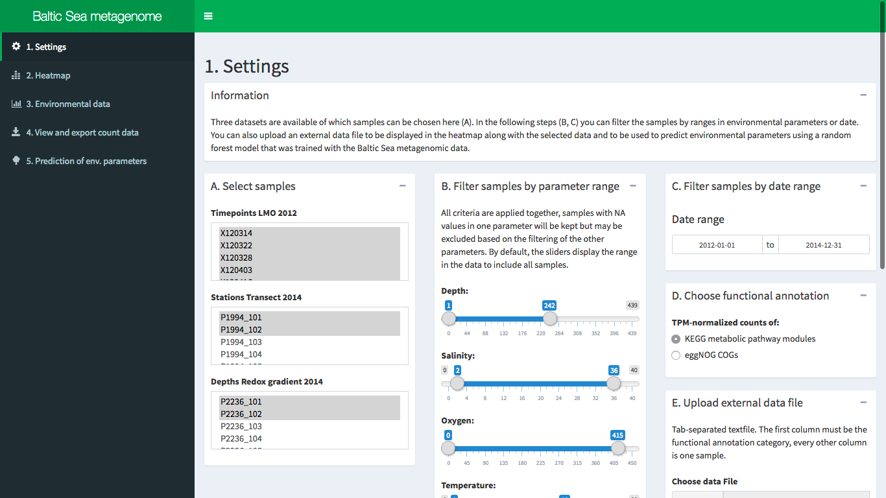
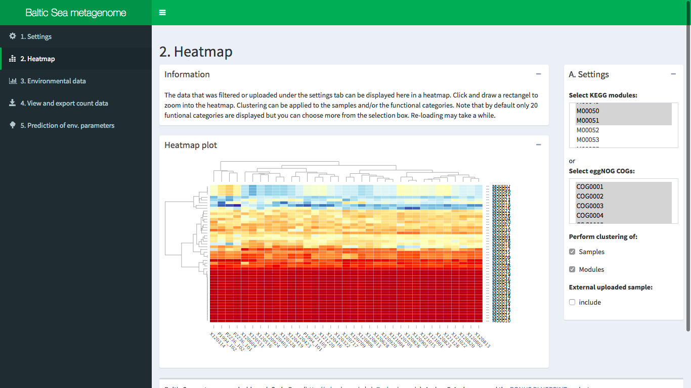

# Baltic Sea metagenome dashboard
Carlo Berg and Anders Andersson

An R Shiny App dashboard to display metagenomic data from various samples of the Baltic Sea. An external sample can be uploaded and used to predict environmental parameters from its metagenomic gene abundance data and application of a random forest model trained with the Baltic Sea metagenomic data.

  
  

## Usage

From the panel on the left side of the app several actions can be performed.  First, the samples can be selected, filtered, and an external data file uploaded that is used alongside with the Baltic Sea metagenome samples. The external data file should be in tab-delimited format. Then, you can view the metagenomic data in a heatmap and view or download the count data as a table. In the final step, the external data file can be used to predict values for several environmental parameters by application of a random forest model that was trained with the Baltic Sea metagenomic data. 

### Data
TPM-mormalized count data of KEGG modules and eggNOGs are used in a tab-delimited format that have to reside in the `data` folder. The table is formatted in wide format, i.e. one column for each sample, and one row for each functional category (KEGG module or eggNOG). The first column lists the KEGG/eggNOG identifiers (`M00001`, `M00002` etc.). Note, that the data is currently not included in this repository.

### External data
The external data file should be in the same format as described above and can be uploaded under the settings tab. 

### Dependencies
Tested with R 3.5.0. Packages needed: shiny, shinydashboard, tidyverse, magrittr, reshape, plotly, d3heatmap, DT, RColorBrewer, randomForest

## Live version
A deployed live version is also available at [cberg.shinyapps.io/baltic-sea-metagenome-dashboard/](https://cberg.shinyapps.io/baltic-sea-metagenome-dashboard/)

## Funding
The [BONUS BLUEPRINT](https://blueprint-project.org) project has received funding from BONUS (Art 185), funded jointly by the EU and the national funding institutions of Denmark, Sweden, Germany, Finland, and Estonia.